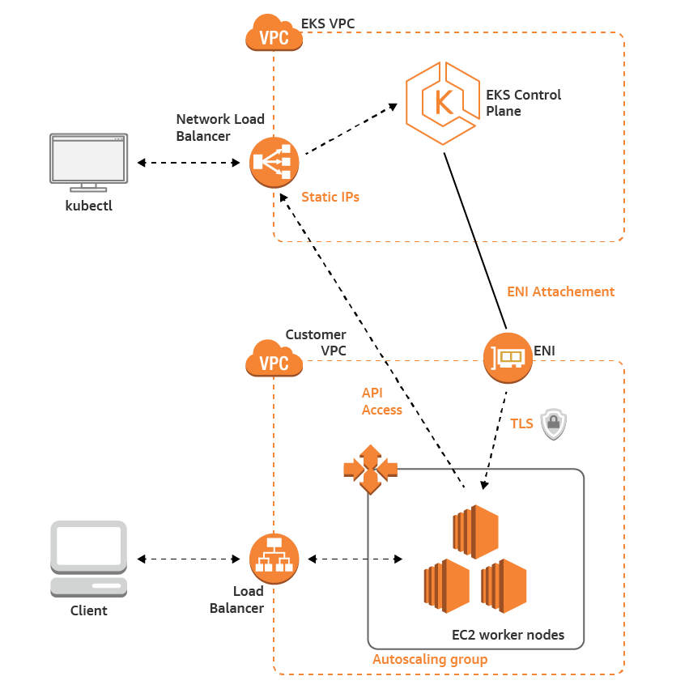

### Set up AKS with CloudFormation script    

#### Prerequisites

1. AWS CLI v1.18.133 or later (`aws --version`)
2. AWS CLI credentials configured (`aws s3 ls`)
3. `kubectl` (command-line utility for communicating with the cluster API server) installed and added to your path (`kubectl version --short --client`)

#### Steps prior to cluster creation

1. Create Amazon EKS cluster IAM role (including creating a stack)
    - Follow steps to upload file (`iam.yaml`) to the CloudFormation console: https://docs.aws.amazon.com/eks/latest/userguide/getting-started-console.html#role-create

2. Create Amazon EKS cluster VPC
    - Follow steps to upload file (`amazon-eks-vpc-private-subnets.yaml`) to the CloudFormation console: https://docs.aws.amazon.com/eks/latest/userguide/getting-started-console.html#vpc-create

#### Application Architecture

Taken from tutorial:
https://docs.aws.amazon.com/eks/latest/userguide/getting-started-console.html

Further steps:
- [Configure Kubernetes Cluster Autoscaler](https://docs.aws.amazon.com/eks/latest/userguide/cluster-autoscaler.html)
- [Deploy a Linux application](https://docs.aws.amazon.com/eks/latest/userguide/sample-deployment.html)
- [Cluster management ](https://docs.aws.amazon.com/eks/latest/userguide/eks-managing.html)

Further tutorials:
- [Interactive Kubernetes Tutorial](https://kubernetes.io/docs/tutorials/kubernetes-basics/)
- [Complete Amazon EKS Microservices Workshop](https://www.eksworkshop.com/)
